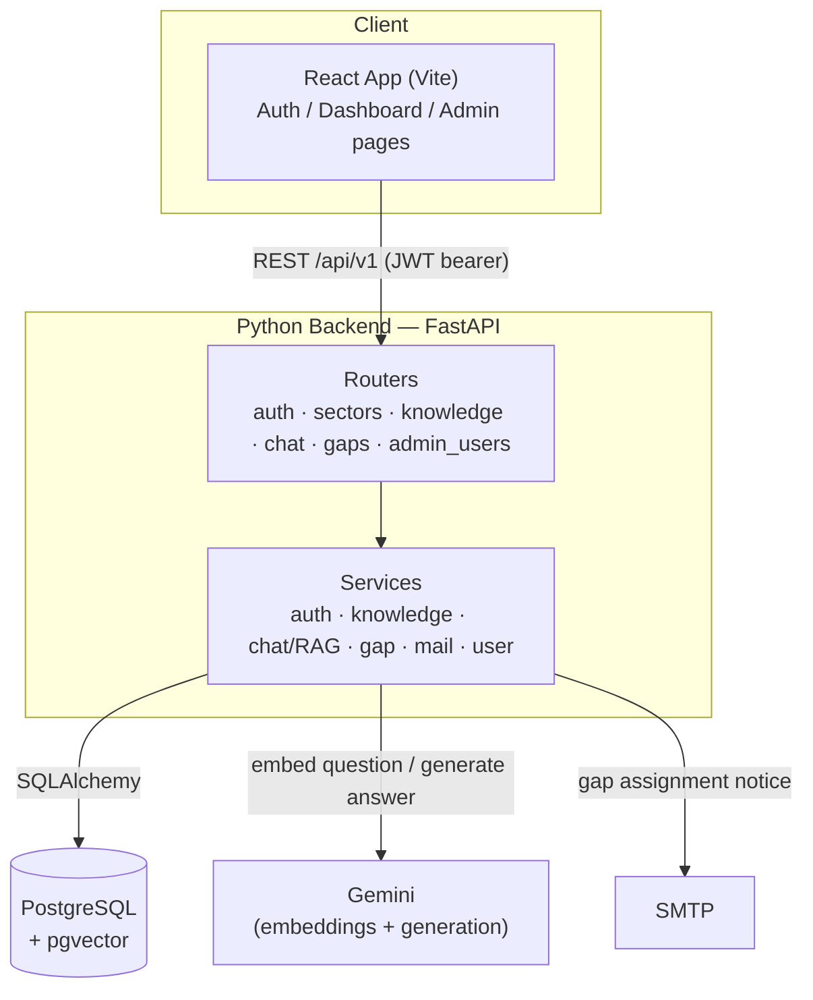

# Technical Architecture

## Diagram

See [Database.md](Database.md) for the full table/ER reference behind the PostgreSQL box.

## Architectural decisions (short)

- **Split repo, no shared code.** `react-app/` and `python-backend/` are independent projects talking only over HTTP — no shared types/build step between them (see each folder's own AGENTS.md).
- **Backend is the source of truth.** Sector membership, role checks, and gap-resolution rules are enforced in backend services (e.g. `knowledge_service._assert_sector_access`), never trusted from the client.
- **Auth: JWT bearer tokens**, not sessions — `core/security.py` signs a `sub=user_id` HS256 token (`jwt_expire_minutes`, default 60). Passwords are bcrypt-hashed via `passlib`.
- **RAG is retrieval-then-generate, not fine-tuning.** `qa_entries.embedding` (pgvector, 768-dim) is searched with cosine similarity (`ivfflat` index); the top match's score is compared against `rag_similarity_floor` (default 0.55) to decide answer vs. knowledge gap, then Gemini generates the grounded answer.
- **Knowledge base is structured Q&A, not file ingestion.** Each entry is `(question, answer, source link)` entered by a sector owner — there is no document upload/chunking pipeline in current scope (kept out of MVP deliberately; see `AGENTS.md` architecture notes).
- **Sector scoping via a join table**, not a role flag — `user_sectors` is a plain many-to-many, so "which sectors can I edit" is a data question, not a permission enum.
- **Notifications: real SMTP**, not a queue/worker — `mail_service.send_email` sends synchronously from the request path when a gap is assigned.
- **One relational store for everything**, including vectors — pgvector inside the same Postgres instance rather than a separate vector DB, so there's a single source of truth and one connection/migration path (Alembic) to manage.

Full rationale and what's still open (hosting, notification channel alternatives, etc.) is in [Plan.md](Plan.md).
