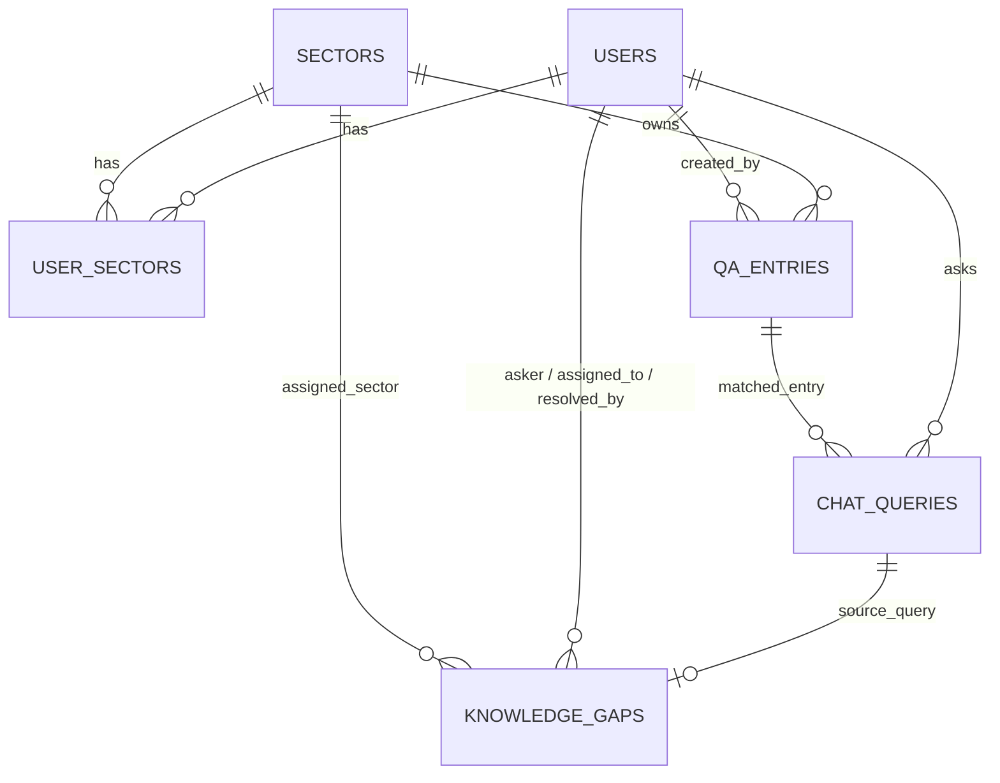

# Database Structure

PostgreSQL + `pgvector`. Schema is owned by SQLAlchemy models in `python-backend/app/db/models/` and
versioned via Alembic migrations in `python-backend/app/db/migrations/versions/`. This doc is a snapshot
for orientation — the migrations are the source of truth.

## Entity relationship overview

## Tables

### `users`
Auth + role/access state.

| Column | Type | Notes |
|---|---|---|
| `id` | UUID PK | |
| `name`, `email`, `username`, `position` | String | `email`/`username` unique + indexed |
| `password_hash` | String | bcrypt |
| `role` | enum `user_role` | `user` \| `superAdmin` |
| `status` | enum `user_status` | `pending` \| `granted` \| `revoked` — gates login |
| `created_at`, `updated_at` | timestamptz | |

### `sectors`
Fixed knowledge domains, plus user-defined "Other" sectors.

| Column | Type | Notes |
|---|---|---|
| `id` | UUID PK | |
| `key` | String, unique | e.g. `onboarding`, `company`, `product`, `project`, or a slug for a custom sector |
| `label` | String | display name |
| `is_custom` | Boolean | `false` for the 4 seeded fixed sectors, `true` for "Other: …" sectors created at signup |

Seeded by migration `0001_initial_schema`: `onboarding`, `company`, `product`, `project`.

### `user_sectors`
Many-to-many join between users and the sectors they belong to (own/can edit).

| Column | Type | Notes |
|---|---|---|
| `user_id` | UUID PK, FK → `users.id` | `ON DELETE CASCADE` |
| `sector_id` | UUID PK, FK → `sectors.id` | `ON DELETE CASCADE` |

### `qa_entries`
The knowledge base itself — one row per Q&A document, embedded for retrieval.

| Column | Type | Notes |
|---|---|---|
| `id` | UUID PK | |
| `sector_id` | UUID, FK → `sectors.id` | which sector owns this entry |
| `question`, `answer` | Text | |
| `source` | String, nullable | citation link/reference |
| `embedding` | `vector(768)` | pgvector column; `ivfflat` index (`vector_cosine_ops`, `lists=100`) for cosine similarity search |
| `created_by` | UUID, FK → `users.id` | |
| `created_at`, `updated_at` | timestamptz | |

### `chat_queries`
Log of every question asked in the chat, with the retrieval result.

| Column | Type | Notes |
|---|---|---|
| `id` | UUID PK | |
| `asker_id` | UUID, FK → `users.id` | |
| `question_text`, `answer_text` | Text | `answer_text` null if it became a gap |
| `matched_entry_id` | UUID, FK → `qa_entries.id`, nullable | the retrieved chunk, if any |
| `similarity_score` | Float, nullable | retrieval confidence used for the gap threshold |
| `is_gap` | Boolean | true if confidence was too low to answer |
| `created_at` | timestamptz | |

### `knowledge_gaps`
Unanswered questions routed to an owner for follow-up.

| Column | Type | Notes |
|---|---|---|
| `id` | UUID PK | |
| `source_query_id` | UUID, FK → `chat_queries.id` | the query that produced the gap |
| `question_text` | Text | |
| `asker_id` | UUID, FK → `users.id` | |
| `status` | enum `gap_status` | `open` \| `assigned` \| `resolved` |
| `assigned_to_id` | UUID, FK → `users.id`, nullable | who's responsible for closing it |
| `assigned_sector_id` | UUID, FK → `sectors.id`, nullable | which sector it was routed to |
| `resolved_by_id` | UUID, FK → `users.id`, nullable | added in migration `0003_add_gap_resolver` |
| `created_at`, `assigned_at`, `resolved_at` | timestamptz, nullable except `created_at` | |

## Migrations

| Revision | Summary |
|---|---|
| `0001_initial_schema` | All tables above (minus `resolved_by_id`), enums, the `vector` extension, the `ivfflat` embedding index, and the 4 seeded fixed sectors. |
| `0002_seed_admin_user` | Seeds an initial superAdmin account. |
| `0003_add_gap_resolver` | Adds `knowledge_gaps.resolved_by_id`, used by the manual gap-resolve flow. |

## Notes for future work

- `EMBEDDING_DIM = 768` (`qa_entry.py`) must match whatever embedding model `services/rag/` calls — changing models means a migration to resize the `vector` column and re-embed existing `qa_entries`.
- Sector access control (who can add/remove `qa_entries` in a sector) is enforced in `knowledge_service._assert_sector_access`, not by a DB constraint — `user_sectors` only records membership.
- There is no soft-delete anywhere; deletes are hard deletes (see `ON DELETE CASCADE` on `user_sectors`).
